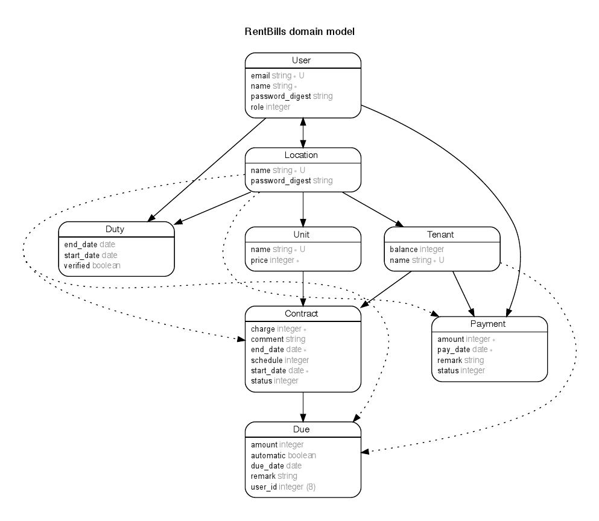

# Rent Bills

 </img>
 

## Program

The working website can be found at http://rent-bills.herokuapp.com/

## Description of program

Rent Bills is a web application to help homeowners monitor rent payments made by tenants.

Homeowners can create a location to represent houses/apartment/condominiums they own. A location could have several units. They can assign a tenant to each unit, based on a contract. A contract lasts for a time period and indicates the monthly rent that tenants need to pay. Homeowners will be able to see the accumulated rent owed/paid by a tenant.

Homeowners can employ keepers to collect payments made by tenants. Keepers will then input how much money they collected when onto the database. Keepers gain access information to a location by sending requests to owners.

## Ruby version

2.5.0

## Schema

The following schema is used by the program.

## Features

User Management
1. Users can sign up, log in and log out based on unique emails.
2. Two types of users are supported: owners and keepers.

Locations and Units
1. Owners and keepers are able to create locations.
2. Keepers can sign themselves up as keepers for a house by sending requests to owners.
3. Owners can accept or reject keepers' request to tend a house.
4. Once keepers have access, they can view the location.

Tenants
1. Owners can add tenants to locations.
2. Owners can create a contract based on how long the tenant stays in a unit and how much the monthly rent is.

Keepers
1. Keepers are able to see an overview of tenants and occupied units in the house.
2. They can see contracts of tenants.

Navigation
1. Owners and keepers have an overivew of locations they manage.
2. Owners have shortcuts to locations they own in the nav bar.

Profile
Users are able to view their own profile through link at navigation bar above.

## Non-functional features
1. SQL queries mostly optimised
2. Authorisation (only owners and keepers are able to view location information)

## Future Development
1. Further optimisation of SQL queries.
2. RSpec tests to be written.
